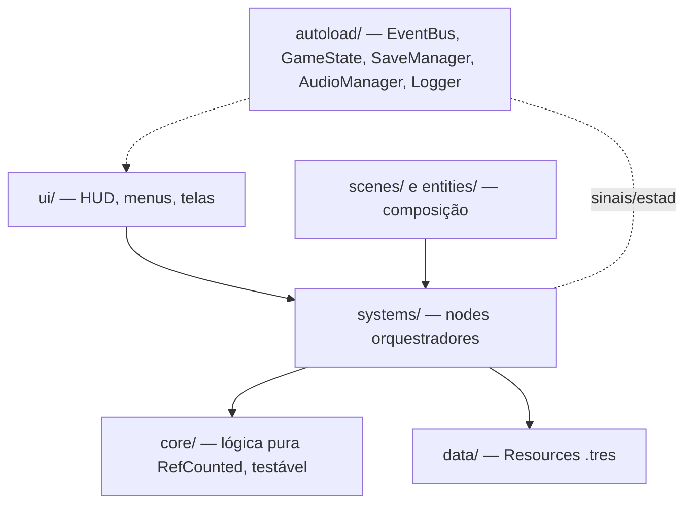
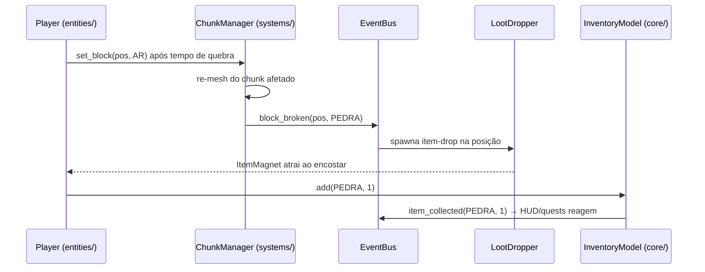

# 02 — Arquitetura Técnica (TDD)

> Engine: Godot 4.7.x + GDScript tipado ([decisão](03-ENGINE-DECISAO.md)). Este documento define **como** o jogo é construído. Regras de ouro: lógica nunca concentrada num script único; dados fora do código; sistemas conversam por sinais, não por referência direta.

## 1. Princípios

1. **Camadas com dependência única direção** — UI e cenas dependem de sistemas; sistemas dependem do core; o core não depende de nada da engine além de tipos básicos.
2. **Core puro e testável** — toda regra de jogo (inventário, craft, dano, geração de mundo, save) vive em classes `RefCounted` sem Node, testáveis headless.
3. **Data-driven** — todo conteúdo (bloco, item, receita, criatura, bioma, missão) é um Resource `.tres`. Conteúdo novo = arquivo novo, zero código.
4. **Composition over inheritance** — entidades são cenas montadas de componentes reutilizáveis.
5. **Signals para acoplamento zero** — sistemas publicam eventos no EventBus; interessados assinam.



## 2. Estrutura de pastas (projeto Godot em `game/`)

```
game/
├── project.godot          # renderer Compatibility; tipagem: warnings→erros
├── autoload/              # os 5 singletons (e só eles)
├── core/                  # lógica pura: inventory/, crafting/, worldgen/, battle/, save/
├── systems/               # chunk_manager, spawn_system, day_night, input_glue
├── entities/              # player/, creatures/, npcs/, props/ (cenas + componentes)
├── components/            # health, state_machine, interactable, item_magnet…
├── scenes/                # main.tscn, world.tscn, menu.tscn, battle.tscn
├── ui/                    # hud/, inventory_screen/, dialog/, theme/
├── data/                  # .tres: blocks/, items/, recipes/, creatures/, biomes/, quests/
├── assets/                # models/, textures/, audio/ (CC0 + próprios)
└── tests/                 # GUT: unit/ (core) e integration/
```

## 3. Autoloads (máximo 5 — decisão firme)

| Autoload | Responsabilidade | O que NÃO faz |
|---|---|---|
| `EventBus` | Catálogo central de signals do jogo | Não guarda estado |
| `GameState` | Máquina de estados global (Boot→Menu→CharacterCreation→Playing⇄Paused⇄Battle), sessão atual (seed, tempo de jogo, aparência do Murilo) | Não conhece UI |
| `SaveManager` | Serializar/desserializar save, versões, migrações | Não decide *o que* salvar (cada sistema fornece seu snapshot) |
| `AudioManager` | Buses, pools de players, tocar música/SFX por nome | Não conhece gameplay |
| `Logger` | Log com níveis (debug/info/warn/error), silencioso em release | — |

## 4. Sistemas

Para cada sistema: onde vive, dados, sinais principais e fase de entrada.

### 4.1 Game Loop / Input (F1, F3)
- `main.tscn` é a raiz; `GameState` dirige transições de cena.
- **Input:** ações abstratas no InputMap (`mover_*`, `pular`, `quebrar`, `colocar`, `interagir`, `hotbar_1..8`, `inventario`, `pausar`). Gameplay lê ações, nunca teclas → touch (F12) vira só um novo mapeamento + camada de UI.

### 4.2 World / Chunk / Map (F2)
- **Dados:** chunk = `PackedByteArray` (1 byte = id de bloco) de 16×16×64; mundo 8×8 chunks. `BlockDef.tres`: id, nome, dureza, ferramenta ideal, drop, textura no atlas.
- **`core/worldgen/`:** geração determinística por seed (FastNoiseLite: altura + camadas + biome map). Puro → testável.
- **`systems/chunk_manager.gd`:** mantém chunks, delega meshing, aplica edições. API única: `get_block(pos)`, `set_block(pos, id)`.
- **Meshing:** 1 `ArrayMesh` por chunk, só faces expostas (face culling), texture atlas único, colisão por `ConcavePolygonShape3D` gerada junto. Edição de bloco → re-mesh só do chunk afetado (+ vizinho se na borda). Meshing **time-sliced** (budget por frame — web é single-thread; ver [Performance](09-PERFORMANCE.md)).
- **Map system:** mundo = seed + dicionário de edições (delta). O mapa-múmdo é derivável; minimapa (F11) lê o biome map.
- Sinais: `block_broken(pos, id)`, `block_placed(pos, id)`.

### 4.3 Entity System (F3+)
- Entidade = cena composta de componentes reutilizáveis: `Health`, `StateMachine`, `Interactable`, `ItemMagnet`, `LootDropper`.
- Player, Cubelins e NPCs seguem o mesmo padrão — sem hierarquia profunda de herança.
- `StateMachine` genérica (nó + estados como nós filhos). Player: Idle/Move/Jump/Mine. Cubelin: Idle/Wander/Flee/Aggro/InBattle.

### 4.4 Inventory (F4)
- **`core/inventory/inventory_model.gd`** (puro): slots, empilhamento, mover/dividir, add/remove com resultado explícito. `ItemDef.tres`: id, nome, ícone, stack máx., categoria.
- UI (`ui/inventory_screen/`) só reflete o modelo e emite intenções. Baús (F6) = segundo `InventoryModel` persistido no mundo.
- Sinais: `item_collected(item, qtd)`, `inventory_changed`.

### 4.5 Craft (F4)
- **`core/crafting/craft_service.gd`** (puro): dado inventário + `RecipeDef.tres` (ingredientes, resultado, exige bancada?), responde `pode_craftar?` e executa transação atômica no modelo.
- Sinal: `recipe_crafted(recipe)`.

### 4.6 Save System (F5)
- **Formato:** JSON com `schema_version` (desde o save nº 1), em `user://saves/slot1.json` (na web, Godot persiste `user://` em IndexedDB automaticamente).
- **Conteúdo:** seed + delta de blocos editados (posição→id) + player (posição, vida, fome) + inventários (mochila, baús) + tempo/dia + Cubelins do jogador (F8) + flags de missões (F9).
- **Migração:** `save_migrator.gd` (puro) com passos v1→v2→v3…; abrir save antigo nunca pode quebrar.
- Autosave ao dormir/sair; save manual no pause.

### 4.7 Creature System (F7)
- `CreatureDef.tres`: espécie, elemento, curvas de stats, tabela de ataques por nível, nível de evolução, espécie-alvo da evolução, biomas de spawn, modelo/cena.
- `CreatureState` (puro, serializável): espécie, nível, XP, HP atual, ataques equipados, apelido.
- `systems/spawn_system.gd`: popula bioma por regras (bioma × dia/noite × densidade máx.).

### 4.8 AI System (F7, F9)
- FSM sobre `CharacterBody3D` com steering simples (vagar, perseguir, fugir) — **sem** NavMesh no terreno voxel (recalcular navmesh a cada edição custa caro; steering + testes de colisão bastam para o comportamento desejado).
- NPCs (F9): FSM Idle/Walk/Talk + rotina fixa por horário.

### 4.9 Combat System (F8)
- **`core/battle/battle_service.gd`** (puro): estado da batalha por turnos, ordem por Agilidade, fórmula de dano, captura, fuga, XP. 100% testável sem cena.
- `scenes/battle.tscn`: apresentação (câmera arena, animações, UI de ações). Mundo pausado durante batalha (`GameState.Battle`).
- `AttackDef.tres`: elemento, poder, custo. Sinais: `battle_started/ended`, `creature_captured`.

### 4.10 Quest System (F9)
- `QuestDef.tres`: objetivos tipados (coletar/construir/derrotar/capturar/explorar), pré-requisitos, recompensas.
- `core/quests/quest_log.gd` (puro) assina eventos do EventBus e avança objetivos — missão nova = arquivo novo, zero código.

### 4.11 Event System (transversal, F1+)
- `EventBus` com signals tipados e documentados no próprio arquivo. Catálogo inicial: `block_broken`, `block_placed`, `item_collected`, `recipe_crafted`, `player_died`, `day_started`, `night_started`, `battle_started`, `battle_ended`, `creature_captured`, `quest_completed`, `game_saved`.
- Regra: sinal entra no catálogo só quando ≥2 sistemas precisam — senão é sinal local do nó.

### 4.12 Audio System (F11; esqueleto na F1)
- `AudioManager` + buses Master/Música/SFX; pool de `AudioStreamPlayer3D` para SFX posicionais; crossfade de música por bioma/estado.

### 4.13 UI System (F4+)
- Tema central único (`ui/theme/theme.tres`); telas são cenas independentes instanciadas por um `UIRoot`; nenhuma tela conhece outra (navegação via GameState/EventBus).

## 5. Fluxo exemplo — quebrar um bloco (ponta a ponta)



## 6. Convenções de código

- GDScript com **tipagem estática obrigatória**; `untyped_declaration` como erro no project.godot.
- `snake_case` para arquivos/funções/variáveis; `PascalCase` para classes/cenas; sinais no passado (`block_broken`).
- 1 script = 1 responsabilidade; script passando de ~200 linhas é sinal de quebra necessária.
- `class_name` para tudo em `core/`; nada em `core/` referencia Node, cena ou autoload.
- Formatação/lint: `gdformat` + `gdlint` (gdtoolkit) no CI.
- Commits semânticos em português (`feat:`, `fix:`, `docs:`…).
